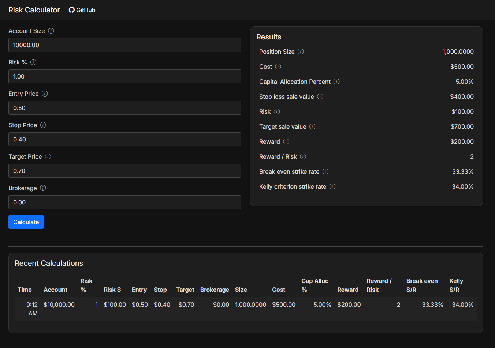
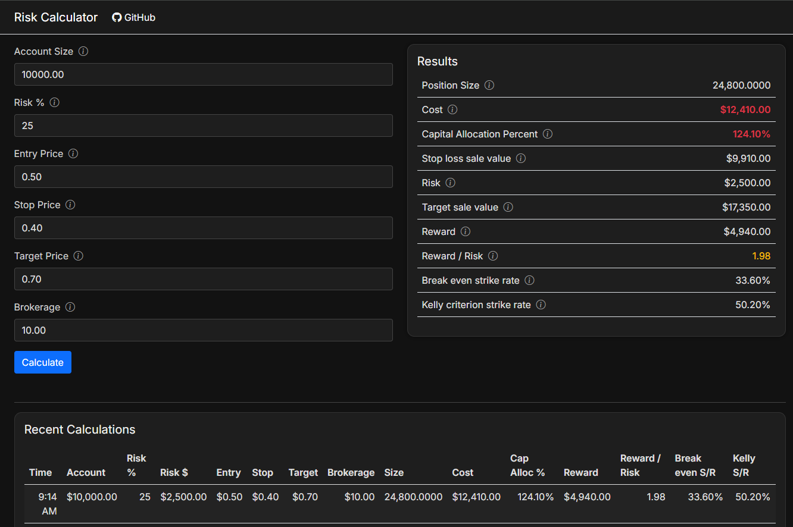

# Risk Calculator

ASP.NET Core trading risk calculator with position sizing, capital allocation, and reward/risk metrics.

## Features

- Position sizing calculator
- Reward / Risk calculations
- Break-even strike rate
- Capital allocation analysis
- Recent calculations table
- Dark mode UI
- Tooltips and validation

## Tech Stack

- ASP.NET Core Razor Pages
- C#
- Bootstrap
- Azure App Service
- xUnit tests

## Live Demo

https://riskcalculator-gmcdonald.azurewebsites.net/

## Screenshots

The input section has tooltips on all input fields to provide additional information, and will validate that all inputs are within the allowable ranges. 
Here is an example:

Here are the results of running a calculation. The last five calculations are also displayed in the Recent Calculations section at the bottom.

If a calculation produces results that outside of defined ranges then warnings are shown in yellow (e.g. Reward / Risk < 2) and errors in red (e.g. Cost > Account Size)

## Formulas

RiskAmount = AccountSize * RiskPercent

RiskPerUnit = EntryPrice - StopPrice

PositionSize = (RiskAmount - 2 * Brokerage) / RiskPerUnit

Cost = PositionSize * EntryPrice + Brokerage

CapAllocPercent = Cost / AccountSize;

StopLossSaleValue = PositionSize * StopPrice - Brokerage

Risk = Cost - StopLossSaleValue

TargetSaleValue = PositionSize * TargetPrice - Brokerage

Reward = TargetSaleValue - Cost

RiskReward = Reward / Risk

BreakEvenStrikeRate = 1 / (RiskReward + 1)

The Kelly Criterion formula is usually used to determine the optimium risk percent based on the probability of winning and the odds offered.
It is defined as

f = risk percent

p = probability of winning

q =  probability of losing = 1 - p

b = odds 

f = p - (q / b) = p - ((1-p) / b)

Here I have rearranged the formula to determine the minimum required win rate based on the given risk percent and riskreward

p = (fb + 1) / (b + 1)

KellyCriterionStrikeRate = (RiskPercent * RiskReward + 1) / (RiskReward + 1)

## Running Locally

1. Clone repo
2. Open solution in Visual Studio
3. Run the project

## Author

Graeme McDonald