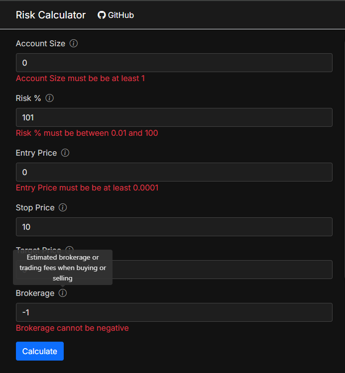

# Risk Calculator

ASP.NET Core trading risk calculator with position sizing, capital allocation, and reward/risk metrics.

## Features

- Position sizing calculator
- Reward / Risk calculations
- Break-even strike rate
- Capital allocation analysis
- Recent calculations table
- Dark mode UI
- Tooltips and validation

## Tech Stack

- ASP.NET Core Razor Pages
- C#
- Bootstrap
- Azure App Service
- xUnit tests

## Live Demo

https://riskcalculator-gmcdonald.azurewebsites.net/

## Screenshots

The has tooltips on all input fields to provide additional information, and will validate that all inputs are within the allowable ranges. 
Here is an example:

This screen shows the results of running a calculation. The last five calculations are also displayed in the Recent Calculations section at the bottom.

If a calculation produces results that outside of defined ranges then warnings are shown in yellow (e.g. reward / risk < 2) and errors in red (e.g. cost > account size)

## Formulas
!!! put stuff here

## Running Locally

1. Clone repo
2. Open solution in Visual Studio
3. Run the project

## Author

Graeme McDonald